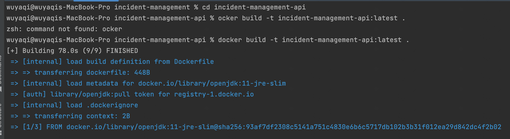
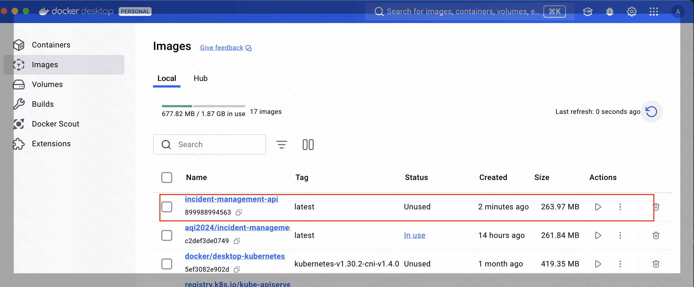
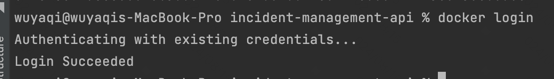
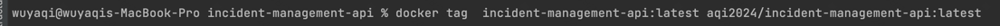
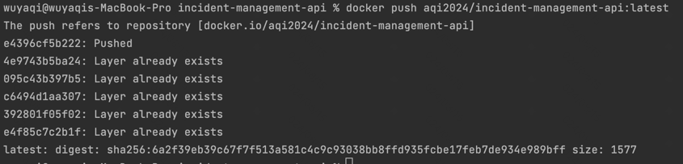
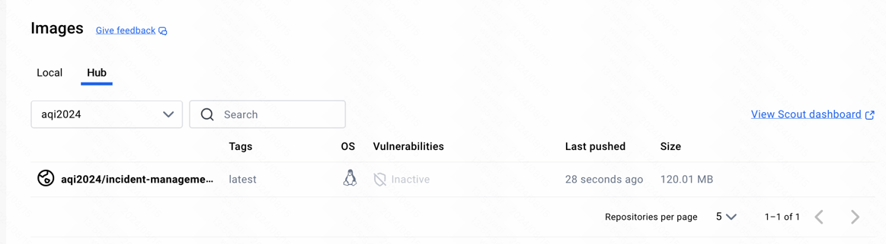
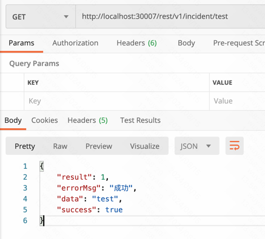
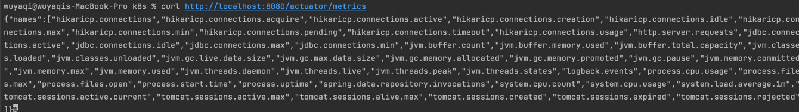
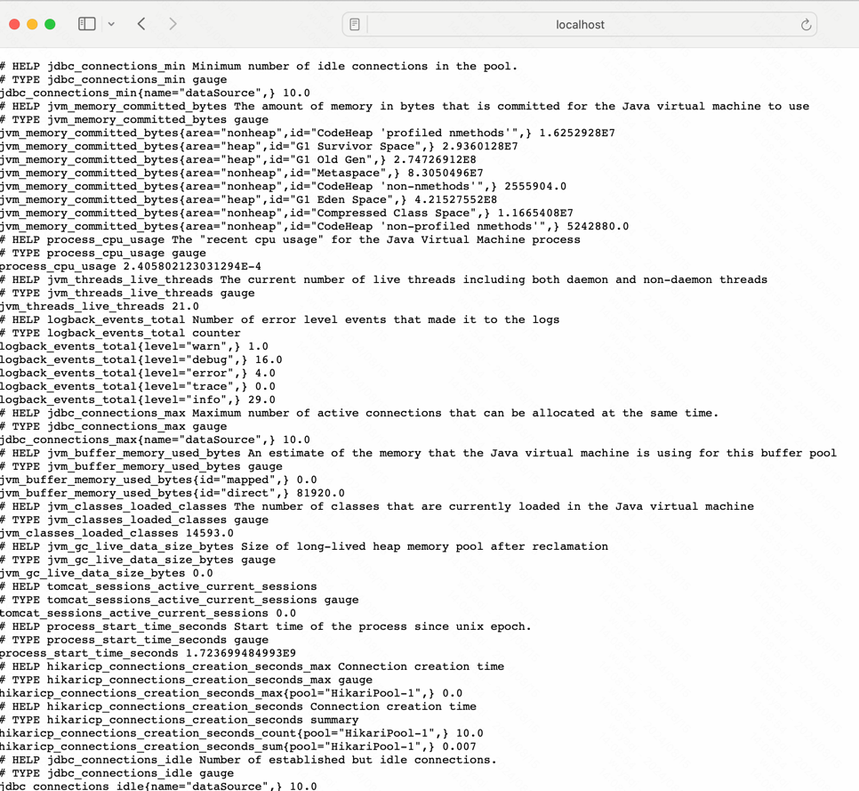

# 事件管理应用

这是一个简单的事件管理应用，允许用户管理事件。该应用包含一个基于 Spring Boot 的后端和一个基于 React 的前端。用户可以通过 Web 界面添加、修改、删除和查看事件。
当前git仅包括后端工程代码，前端代码位于：https://github.com/wuyaqi2014/incident-management-frontend
## 特性

- **事件管理**：创建、更新、删除和查看事件。
- **事件内容**：title、discription、startTime、endTime、remark
- **事件状态**：新建、处理中、已解决、已删除
- **内存存储**：数据存储在H2本地内存数据库中，没有持久存储。
- **验证和错误处理**：实现了适当的验证和错误处理机制。
- **权限校验**：有super管理员权限：admin或者system，非管理员用户只能查看自己创建的事件。

## 技术栈

- **后端**：Java, Spring Boot
- **前端**：React
- **构建工具**：Maven（用于 Java）
- **其他**：Docker（用于容器化）,k8s(用于集群部署),jmeter(用于监控)，Actuator（用于监控）

## 快速开始

### 先决条件

- Java 11 或更高版本
- Maven

### 后端设置

1. **克隆仓库：**

    ```bash
    git clone <repository-url>
    cd incident-management
    ```

2. **构建后端：**

   使用 Maven 构建 Spring Boot 后端。会在 `incident-management-api/target` 目录中生成可执行 JAR 文件。

    ```bash
    mvn clean package
    ```

3. **运行后端：**

   通过java -jar命令执行jar包，即可运行后端程序。

    ```bash
    java -jar incident-management-api/target/incident-management-api.jar
    ```

   后端将可在 `http://localhost:8090/rest/v1/incident/test` 访问。

### 前端设置
参考[README](https://github.com/wuyaqi2014/incident-management-frontend)

### 使用 Docker

1. **构建 Docker 镜像：**  

   在后端incident-management-api目录下执行以下命令：

    ```bash
    docker build -t incident-management-api:latest .
    ```
     
   

2. **运行Docker容器：**  
    ```bash
    docker run -d -p 8090:8080 incident-management-api:latest
    ```
   '-d'：在后台运行容器  
   '-p 8090:8080'：将容器的 8090 端口映射到主机上的 8080 端口
3. **浏览器访问：**  
   现在，后端将可在 `http://localhost:8090/rest/v1/incident/test` 访问。

### 使用 k8s  

1. **将docker镜像推送到Docker hub：**  

    ```bash
    docker login
    ```
   
2. **标记镜像：**

    ```bash
     docker tag  incident-management-api:latest your-dockerhub-username/incident-management-api:latest
    ```
     
3. **推送镜像到Docker Hub：**
    ```bash
   docker push your-dockerhub-username/incident-management-api:latest
    ```
     
     
4. **部署文件：(deployment.yaml)**
   参考目录：incident-management-api/k8s/deployment.yaml
   replicas：定义运行的应用副本数量。
   image：指定容器镜像的地址。
5. **服务文件 service.yaml**
   参考目录：incident-management-api/k8s/service.yaml
   NodePort：将服务暴露在 Kubernetes 集群外部，通过节点的 IP 访问。
6. **部署到kubernetes集群**
   ```bash
   kubectl apply -f deployment.yaml
   kubectl apply -f service.yaml
    ```
7. **浏览器访问**   
 对外暴漏30007端口，可访问：  
现在，后端将可在 `http://localhost:30007/rest/v1/incident/test` 访问。
   

### 性能测试
   使用springboot actuator 提供的jmx接口进行性能测试。
   增加了spring-boot-starter-actuator依赖包，
   同时配置了actuator端点 
1. **通过curl请求，返回所有指标名称列表**
   ```bash
    curl http://localhost:8080/actuator/metrics
    ```
   

2. **通过curl请求,查看特定指标的数据:**
   ```bash
     curl http://localhost:8080/actuator/metrics/http.server.requests
    ```
   返回：
    ```bash
    {"name":"http.server.requests","description":null,"baseUnit":"seconds","measurements":[{"statistic":"COUNT","value":11.0},{"statistic":"TOTAL_TIME","value":0.7007925409999999},{"statistic":"MAX","value":0.011495042}],"availableTags":[{"tag":"exception","values":["None","HttpRequestMethodNotSupportedException","PlatformException"]},{"tag":"method","values":["POST","PUT","GET"]},{"tag":"uri","values":["/rest/v1/incident/incident_list_all","root","/rest/v1/incident/delete_incident/{id}","/rest/v1/incident/test","/rest/v1/incident/update_incident/{id}","/rest/v1/incident/create_incident","/actuator/metrics"]},{"tag":"outcome","values":["SUCCESS"]},{"tag":"status","values":["200"]}]}    
    ```
3. **健康检查/health端点**  
   ```bash
    curl http://localhost:8080/actuator/health    
    ```
4. **通过/actuator/prometheus查看prometheus监控数据:**  
   ```bash
    curl http://localhost:8080/actuator/prometheus
    ```
     
### 

## API 端点  

后端提供了以下 RESTful API 端点：  

- `GET /rest/v1/incident/incident_list_all`：列出所有事件，分页查询。
- `POST /rest/v1/incident/create_incident`：创建一个新事件。
- `PUT /rest/v1/incident/update_incident/{id}`：更新一个现有事件。
- `PUT /rest/v1/incident/delete_incident/{id}`：按 ID 删除一个事件。

### 示例 API 请求

以下是使用 `curl` 创建新事件的示例：

新建title："title1"的事件：
   ```bash
    curl --location --request POST 'http://localhost:8080/rest/v1/incident/create_incident' \
    --header 'Content-Type: application/json' \
    --data-raw '{
      "title": "title1",
      "description": "description1",
      "startTime": 1723651200000,
      "endTime": 1723737600000,
      "remark": "remark"
    }'
   ```
首次新建返回：  
   ```bash
  {
    "result": 1,
    "errorMsg": "成功",
    "data": {
        "incidentId": 2,
        "success": true
    },
    "success": true
}
   ```
再次新建title："title1"的事件，会提示相同该用户下title不能重复：
   ```bash
    curl --location --request POST 'http://localhost:8080/rest/v1/incident/create_incident' \
    --header 'Content-Type: application/json' \
    --data-raw '{
      "title": "title1",
      "description": "description1",
      "startTime": 1723651200000,
      "endTime": 1723737600000,
      "remark": "remark"
    }'
   ```
新建事件返回：  
   ```bash
  {
    "result": 2,
    "errorMsg": "同一用户下，title不能重复",
    "data": null,
    "success": false
  }
   ```
查询事件列表：支持分页查询，从第一页开始。  
   ```bash
    curl --location --request POST 'http://localhost:8080/rest/v1/incident/incident_list_all' \
    --header 'Content-Type: application/json' \
    --data-raw '{
      "page": 1,
      "pageSize":4
    }'
   ```
查看事件列表返回：
   ```bash
  {
    "result": 1,
    "errorMsg": "成功",
    "data": {
        "data": [
            {
                "id": 1,
                "title": "title1",
                "description": "description1",
                "status": 1,
                "startTime": 1723651200000,
                "endTime": 1723737600000,
                "remark": "remark",
                "createdBy": "wuyaqi",
                "updatedBy": "wuyaqi",
                "createdTime": 1723700056304,
                "updatedTime": 1723700056304
            }
        ],
        "currentPage": 1,
        "pageSize": 4,
        "totalCount": 1
    },
    "success": true
  }
   ```
编辑事件请求  
   ```bash
  curl --location --request PUT 'http://localhost:8080/rest/v1/incident/update_incident/1' \
  --header 'Content-Type: application/json' \
  --data-raw '{
  "title": "title2",
  "description": "description1",
  "startTime": 1723651200000,
  "endTime": 1723737600000,
  "remark": "title2"
  }'
   ```
编辑事件返回：     
   ```bash
   {
    "result": 1,
    "errorMsg": "成功",
    "data": {
        "incidentId": 1,
        "success": true
    },
    "success": true
  }
   ```

再次查询列表返回如下：title和remark字段有变更
   ```bash
   {
    "result": 1,
    "errorMsg": "成功",
    "data": {
        "data": [
            {
                "id": 1,
                "title": "title2",
                "description": "description1",
                "status": 1,
                "startTime": 1723651200000,
                "endTime": 1723737600000,
                "remark": "title2",
                "createdBy": "wuyaqi",
                "updatedBy": "wuyaqi",
                "createdTime": 1723700056304,
                "updatedTime": 1723700250509
            }
        ],
        "currentPage": 1,
        "pageSize": 4,
        "totalCount": 1
    },
    "success": true
}
   ```
删除事件请求：  
   ```bash
    curl --location --request PUT 'http://localhost:8080/rest/v1/incident/delete_incident/1' \
    --header 'Content-Type: application/json' \
      --data-raw ''
   ```
删除事件返回：  
   ```bash
    {
      "result": 1,
      "errorMsg": "成功",
      "data": true,
       "success": true
    }
   ```
再次查询列表返回结果为空  
   ```bash
    {
    "result": 1,
    "errorMsg": "成功",
    "data": {
        "data": null,
        "currentPage": 1,
        "pageSize": 4,
        "totalCount": 0
    },
    "success": true
  }
   ```

##  项目架构：  
### 采用父子module结构，parent module为：incident-management-parent，子module如下：  
```plaintext
incident-management
├── HELP.md
├── README.md
├── incident-management-api
│   ├── Dockerfile
│   ├── k8s
│   │   ├── deployment.yaml
│   │   └── service.yaml
│   ├── pom.xml
│   └── src
│       ├── main
│       └── test
├── incident-management-component
│   ├── pom.xml
│   └── src
│       ├── main
│       └── test
└── pom.xml
 ```     
### incident-management-api模块：对外提供restful接口，提供给前端调用。  

```plaintext
.com.example.incidentmanagement
├── IncidentManagementApplication.java
├── annotation
│   ├── PrintLog.java
│   └── PrintLogAspect.java
├── common
│   ├── ApiConstant.java
│   └── ExceptionHandlers.java
├── controller
│   └── IncidentController.java
├── model
│   └── ResponseObject.java
├── param
│   ├── IncidentParam.java
│   └── PageParam.java
├── sso
│   └── SSOUtil.java
└── vo
    ├── IncidentDetail.java
    └── IncidentResultVO.java
 ```  
1. IncidentManagementApplication.java：这是Spring Boot应用的主入口点。  
   包含@SpringBootApplication注解，用于启动Spring Boot应用。  
   在此类中，有定义main方法，是应用程序的启动点。  
2. annotation/：此目录包含自定义注解和相关的切面（Aspect）。
   PrintLog.java：一个自定义注解，用于标记需要记录日志的方法或类。
   PrintLogAspect.java：这是一个切面（Aspect），实现了对带有@PrintLog注解的方法的日志记录逻辑。所有有切面的地方，都会打印入参和出参
3. common/：此目录包含应用的通用组件和工具类。
   ApiConstant.java：包含API相关的常量，如URL等。
   ExceptionHandlers.java：处理应用程序中抛出的各种异常，提供统一的错误响应。
4. controller/：包含控制器类，如IncidentController.java，用于处理与事件管理相关的HTTP请求。  
5. model/：包含数据模型类，如ResponseObject.java，用于封装API响应的数据和状态。
6. param/：此目录下的类用于封装请求参数，如IncidentParam.java用于事件操作的请求参数，PageParam.java可能用于分页查询的参数。
7. sso/：单点登录（Single Sign-On）相关的类，如SSOUtil.java，用于处理用户的认证和授权。目前返回固定值
8. vo/：值对象（Value Object）目录，包含用于表示业务逻辑中的复杂数据结构的类，如IncidentDetail.java和IncidentResultVO.java，用于表示事件的详细信息和处理结果。
这种包结构有助于保持代码的清晰和模块化，更容易地理解和维护代码。

### incident-management-component
```plaintext
.
└── com.example.incidentmanagement
    ├── adapter
    │   └── IncidentRepositoryImpl.java
    ├── application
    │   └── service
    ├── common
    │   ├── DataAuthUtil.java
    │   ├── ObjectMapperUtils.java
    │   ├── Page.java
    │   ├── PlatformException.java
    │   └── enums
    ├── domain
    │   ├── entity
    │   ├── repository
    │   ├── validator
    │   └── valueobject
    └── persisitence
        ├── IncidentJpaRepository.java
        └── entity
 ``` 
详细介绍：  
1. adapter/：适配器层，负责将外部系统（如数据库、远程服务等）的调用转换为领域层可以理解的操作。本项目只依赖数据库，没有远程服务：
   IncidentRepositoryImpl.java：是对数据库的实现，作为domain/repository接口的实现，将数据库操作转化为领域语言。
2. application/：应用层，这里包含了业务逻辑和服务层的实现。例如：
   service/：包含了具体的业务服务类，这些服务类通常使用领域层的对象和适配器层提供的接口来执行业务逻辑。
3. common/：通用工具和共享资源，包括各种工具类和枚举类型。例如：
   DataAuthUtil.java：可能用于数据权限验证的工具类。
   ObjectMapperUtils.java：可能用于对象序列化和反序列化的工具类。
   Page.java：可能用于分页查询的模型类。
   PlatformException.java：自定义异常类，用于表示平台级别的错误。
   enums/：枚举类型，用于定义固定的一系列值，如状态码等。
4. domain/：领域模型层，包含了业务领域的核心概念。例如：
   entity/：领域实体类，代表业务领域的核心对象。本次服务没没有涉及，实体和数据库内的incident一样
   repository/：领域仓库接口，定义了实体的持久化操作，而不关心具体的实现细节。
   validator/：领域验证器，用于验证领域对象的状态是否合法。
   valueobject/：值对象，用于封装一组属性，其语义取决于这些属性的组合，而不是引用相等性。
5. persisitence/：持久化层，处理数据存储和检索的具体实现。例如：
   IncidentJpaRepository.java：使用JPA（Java Persistence API）的Repository接口，提供了对数据库的访问能力。
   entity/：JPA实体类，映射到数据库表，用于数据的存储和检索。  

使用DDD领域驱动架构，清晰不同层次的功能和责任，使系统更加灵活、易于扩展和测试。
适配器层的存在允许领域逻辑与外部系统（如数据库、网络服务）的实现细节分离，从而提高了整个系统的内聚性和解耦度。


以上是该项目的所有后端工作，由于时间原因，还有部分功能待优化：  
1、功能相关：  
   （1）、添加用户管理功能，目前只支持单用户，后续会添加用户管理功能，支持多用户。  
   （2）、添加事件状态管理功能，目前只支持创建事件，后续会添加事件状态管理功能，根据事件的startTime和endTime进行异步状态扭转。  
   （3）、添加事件查询功能，目前只支持分页查询，后续会添加事件查询功能，支持根据事件ID、title、description、startTime、endTime、status  
2、权限相关：  
   （1）、由于没有登录功能，目前所有操作的用户都是"wuyaqi", 查询、编辑都是只能查到操作人为"wuyaqi"的所有事件。  
3、单元测试：  
   （1）、添加单元测试，目前只支持手动测试，单元测试用例较少，后续会添加单元测试，支持自动化测试  
4、多线程、高并发：  
   （1）、由于现在后端功能较为简单，暂未考虑多线程、高并发等场景，后续如果有需要可增加  
5、缓存:   
   （1）、现有的功能：新建、编辑、删除，都需要增加缓存。  
   （2）、查询list，可以增加缓存，但是目前是分页查询，不适合增加缓存。  
   （3）、像页面上的操作的功能，不适合增加缓存，如果增加缓存，需要增加刷新频率，否则就会出现页面不一致的情况。影响使用。
   （4）、对外提供的rpc查询接口，比如查全量事件接口，可以适当增加缓存，减少sql的压力。
6、日志：
   （1）、增加traceId,后续方便查问题。